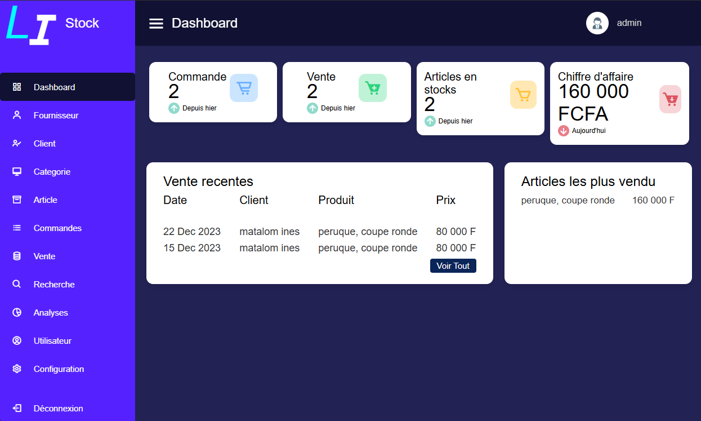
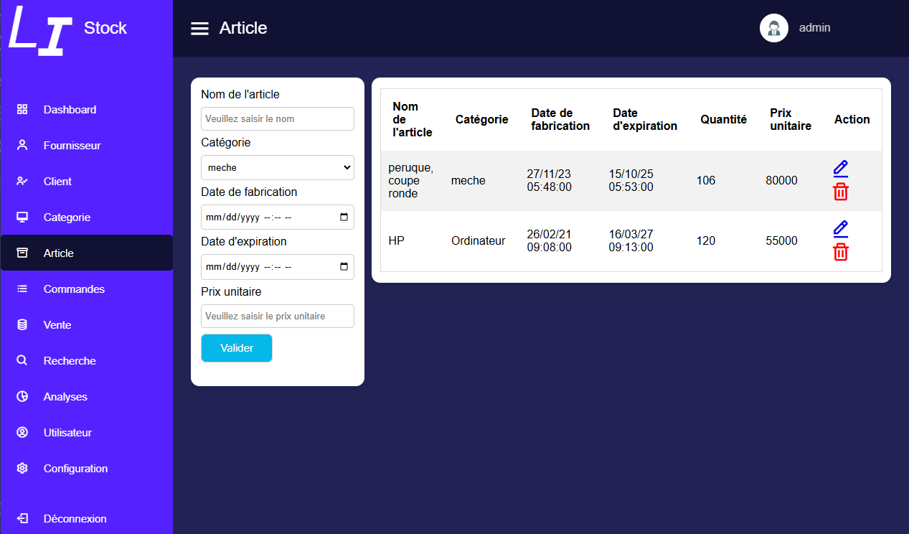

# Stock Management System Pro

## Screenshots
### Dashboard


### Article Management


## Overview
A professional multi-user inventory management system with role-based access control (admin/user). Built with PHP and MySQL for reliable stock tracking and business operations management.

## Setup Instructions

### Prerequisites
- PHP 7.4 or higher
- MySQL 5.7 or higher
- Apache/Nginx web server
- Composer (PHP package manager)

### Installation Steps
1. **Clone the repository**
   ```bash
   git clone https://github.com/toscani-tenekeu/stock-management.git
   cd stock-management
   ```

2. **Database Setup**
   - Create a new MySQL database -> 'li_stock'
   - Import the SQL file from `/db/li_stock.sql`
   ```bash
   mysql -u your_username -p your_database_name < db/li_stock.sql
   ```

3. **Configuration**
   - Copy `.env.example` to `.env`
   - Update database credentials in `.env`
   ```bash
   DB_HOST=localhost
   DB_NAME=your_database_name
   DB_USER=your_username
   DB_PASS=your_password
   ```

4. **Install Dependencies**
   ```bash
   composer install
   ```

5. **Set Permissions** (for Linux/Unix)
   ```bash
   chmod 755 -R storage/
   chmod 755 -R uploads/
   ```

6. **Default Login**
   - Admin:
     - Username: admin
     - Password: admin
   - User test:
     - Username: alice
     - Password: alice

## Features
- Category Management
- Product/Article Management 
- User Management (Admin only)
- Search Functionality
- Stock Level Tracking
- Multi-language Support (English/French)
- Responsive Dashboard Interface

## Architecture
- Admin Portal (`/admin`)
  - Full system access
  - User management
  - Complete CRUD operations
- User Portal (`/user`) 
  - Limited access
  - View and search operations
  - Basic stock management

## Technologies
- PHP
- MySQL
- HTML/CSS
- JavaScript
- Box Icons

## Commercial Licensing
This is proprietary software available under paid commercial license only:

### License Terms
- Single installation license per business location
- User-based pricing tiers available
- Annual maintenance and support fees apply
- Modifications and redistribution prohibited
- Source code access requires enterprise license

### Pricing
Contact sales for current pricing:
- Basic License (up to 5 users)
- Professional License (up to 20 users) 
- Enterprise License (unlimited users)

## Support
Technical support available for licensed users:
- Email: toscanisoft@gmail.com
- GitHub: [@toscani-tenekeu](https://github.com/toscani-tenekeu)

## Copyright
© 2024-2025 Toscani Tenekeu. All Rights Reserved.
This software is proprietary and confidential. Unauthorized copying, modification or distribution is strictly prohibited.

*For licensing inquiries contact: toscanisoft@gmail.com*